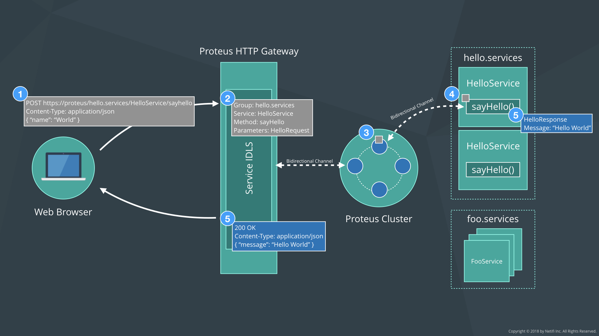

# Netifi Proteus HTTP Gateway

An API Gateway that allows bridging HTTP with [Netifi Proteus](https://www.netifi.com/proteus.html).

## How does the Proteus HTTP Gateway work?
The diagram below shows the high-level architecture of how messages are received and routed by the Proteus HTTP Gateway.
 

#### 1. Send HTTP Request
Client makes an HTTP POST request to a URL in one of the following format:

If automatic load-balancing across a group of services is desired:

    https://{gateway host}/{group}/{service}/{method}

If a specific service instance is desired:

    https://{gateway host}/{group}/{destination}/{service}/{method}
    
The request body must be in JSON format and the field names much match those of the service IDL.

#### 2. Convert HTTP Request to Proteus
The incoming HTTP request is mapped to a Proteus Service IDL based on the URL and request body. The JSON request body fields
must match the fields on the IDL exactly. 

If no matching IDL can be found an error is returned.

#### 3. Send Request via Proteus Channel
The request is then sent to the Proteus Broker cluster which transparently handles service discovery and load balancing to the backend services.

If a destination was specified in the URL then the request will be sent to that specific instance. If only a group was specified, Proteus will
load balance the request to the healthiest, most performant instance, in the group using our Predictive Load Balancing algorithm.

#### 4. Invoke Service Method
The request arrives and invokes the Proteus service method.

#### 5. Send Response via Proteus Proteus Channel
The Proteus service response is sent to the Proteus Broker cluster via the same bidirectional channel used by the request.

#### 6. Send HTTP Response
The Proteus service response is converted into an HTTP response with a JSON message body and sent back to the requesting client to
complete the interaction.

## Building Proteus HTTP Gateway
You can build Proteus HTTP Gateway as an executable jar using the following command:

    $ ./gradlew clean build

## Bugs and Feedback
For bugs, questions, and discussions please use the [Github Issues](https://github.com/netifi-proteus/proteus-httpgateway/issues).

## License
Copyright 2018 [Netifi Inc.](https://www.netifi.com)

Licensed under the Apache License, Version 2.0 (the "License");
you may not use this file except in compliance with the License.
You may obtain a copy of the License at

   http://www.apache.org/licenses/LICENSE-2.0

Unless required by applicable law or agreed to in writing, software
distributed under the License is distributed on an "AS IS" BASIS,
WITHOUT WARRANTIES OR CONDITIONS OF ANY KIND, either express or implied.
See the License for the specific language governing permissions and
limitations under the License.